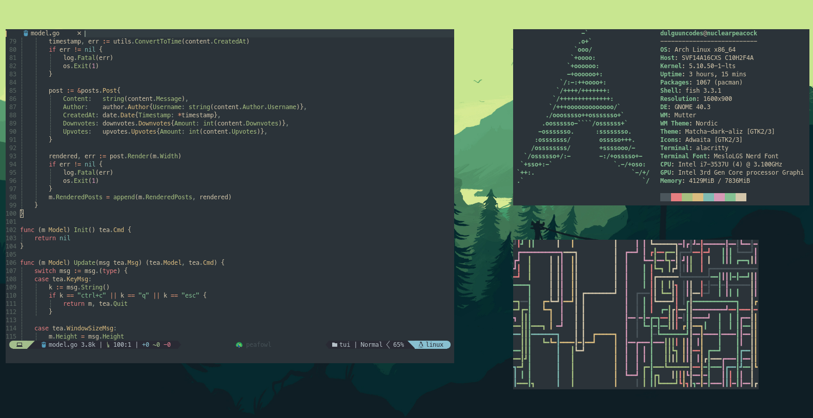

# 🦚 - Peafowl

An elegant Neovim configuration focused on customizability and performance.



## Requirements

- Neovim 0.5+
- lua-language-server (for Lua LSP support) (optional)
- bash-language-server (for bash LSP support) (optional)
- graphql-lsp (for GraphQL LSP support) (optional)
- vscode-html-languageserver (for HTML LSP support) (optional)
- elixir-ls (for Elixir LSP support) (optional)

## Installation

**Warning: Make sure you have backed up your previous Neovim configuration**

```
git clone https://github.com/dulguuncodes/peafowl ~/.config/nvim`
cd ~/.config/nvim
nvim -u bootstrap.lua +:PackerInstall`
```

**NOTE: You will see some errors on startup, ignore them. The installation will
start shortly**

## Supported Programming Languages

- ✅ - Fully Supported

- ⏳ - Half Supported/WIP

- ❌ - Not Supported

|        Language        |     Syntax Highlighting    | LSP support | Linting |
| ---------------------- | :------------------------: | :---------: | :-----: |
| Python                 |      ✅                    | ✅          | ✅      |
| Go                     |      ✅                    | ✅          | ✅      |
| Rust                   |      ✅                    | ✅          | ✅      |
| Elixir                 |      ✅                    | ✅          | ✅      |
| Typescript/Javascript  |      ✅                    | ✅          | ✅      |
| React (jsx/tsx)        |      ✅                    | ✅          | ✅      |
| Dart/Flutter           |      ✅                    | ✅          | ✅      |
| HTML                   |      ❌ (unstable)         | ⏳ (wip)    | ❌      |
| JSON                   |      ✅                    | ⏳ (wip)    | ✅      |
| Lua                    |      ✅                    | ⏳ (wip)    | ✅      |
| YAML                   |      ✅                    | ❌          | ✅      |
| Dockerfile             |      ✅                    | ❌          | ✅      |
| Shell (fish/bash/zsh)  |      ✅                    | ⏳ (wip)    | ✅      |
| GraphQL                |      ❌ (non-functional)   | ⏳ (wip)    | ❌      |

